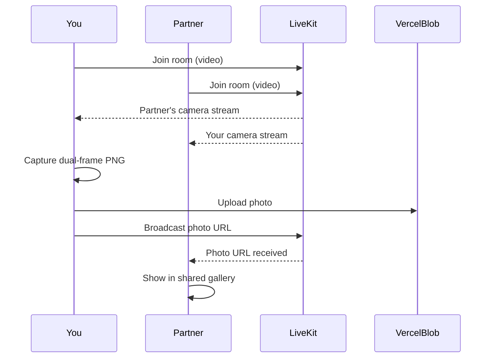

# Photobooth

A private website with a **shared** in-browser photobooth. Two people join the same room, see each other's live camera feed, apply filters, capture photos together, and download from a gallery that syncs between both devices.

## Features

- **Shared live video** via LiveKit — both cameras visible on both screens
- Real-time CSS filter presets on your feed (Vintage, B&W, Dreamy, Warm, etc.)
- Transparent PNG frame overlay baked into captures
- 3-second countdown before each photo
- **One person captures → both see the same photo** (synced via LiveKit + Vercel Blob)
- Per-photo PNG download on either device
- Optional passphrase privacy gate via Edge Middleware

## Tech Stack

- Next.js 14 (App Router) + TypeScript
- Tailwind CSS
- [LiveKit Cloud](https://cloud.livekit.io) — real-time video rooms (free tier)
- [Vercel Blob](https://vercel.com/docs/storage/vercel-blob) — shared photo storage

## Getting Started

### Prerequisites

- [Node.js](https://nodejs.org/) 18+
- A [LiveKit Cloud](https://cloud.livekit.io) project (free)
- A Vercel Blob store (create in your Vercel project dashboard)

### 1. Install dependencies

```bash
npm install
```

### 2. Configure environment variables

Copy the example file and fill in your values:

```bash
cp .env.local.example .env.local
```

| Variable | Where to get it |
|----------|-----------------|
| `LIVEKIT_API_KEY` | LiveKit Cloud → Project → Settings → API Keys |
| `LIVEKIT_API_SECRET` | Same as above |
| `NEXT_PUBLIC_LIVEKIT_URL` | LiveKit Cloud → Project Settings (WebSocket URL, e.g. `wss://your-app.livekit.cloud`) |
| `BLOB_READ_WRITE_TOKEN` | Vercel Dashboard → Storage → Blob → Tokens |
| `SITE_PASSPHRASE` | *(optional)* Your private site passphrase |
| `SITE_COOKIE_SECRET` | *(optional)* Long random string for cookie signing |

### 3. Run locally

```bash
npm run dev
```

Open [http://localhost:3000](http://localhost:3000).

### 4. Use the shared photobooth

1. Open **Open the photobooth**
2. Enter your name and a room name (e.g. `our-room`)
3. **Copy the share link** and send it to your partner
4. They open the same link, enter their name, and join
5. Both of you see **You** and **Partner** camera tiles
6. Either person taps **Take photo** — it appears in the **Shared gallery** for both

## Deploy to Vercel (Hobby plan)

1. Push this repo to GitHub
2. Import the project in [Vercel](https://vercel.com/new)
3. Create a **Blob store** in the Vercel project (Storage tab)
4. Add all environment variables from `.env.local.example`
5. Deploy

LiveKit and Blob both have free tiers sufficient for a personal photobooth session.

## How shared photos work



Captured photos are stored in Vercel Blob under `photos/{room}/`. They persist for the room so late joiners can still see previous shots.

## Privacy notes

- Live video streams go through **LiveKit** (encrypted WebRTC)
- Captured photos are stored in **Vercel Blob** (public URLs within the room — suitable for a private site behind your passphrase gate, not for highly sensitive content)
- The optional passphrase gate is a lightweight deterrent, not bank-grade security

## Customization

- **Frame overlay:** Replace `public/overlays/frame-ornate.svg`
- **Landing copy:** Edit `src/app/page.tsx`
- **Filter presets:** Edit `src/lib/filters.ts`

## Project structure

```
src/
├── app/
│   ├── photobooth/page.tsx       # Room lobby + shared session
│   ├── api/livekit/token/        # LiveKit access tokens
│   └── api/photos/               # Blob upload + list
├── components/
│   ├── SharedPhotobooth.tsx      # LiveKit room + capture flow
│   ├── DualCameraView.tsx        # Side-by-side feeds
│   └── RoomLobby.tsx             # Join room + copy link
└── lib/
    ├── captureFrame.ts           # Single + dual canvas merge
    └── room.ts                   # Room helpers + sync messages
```
