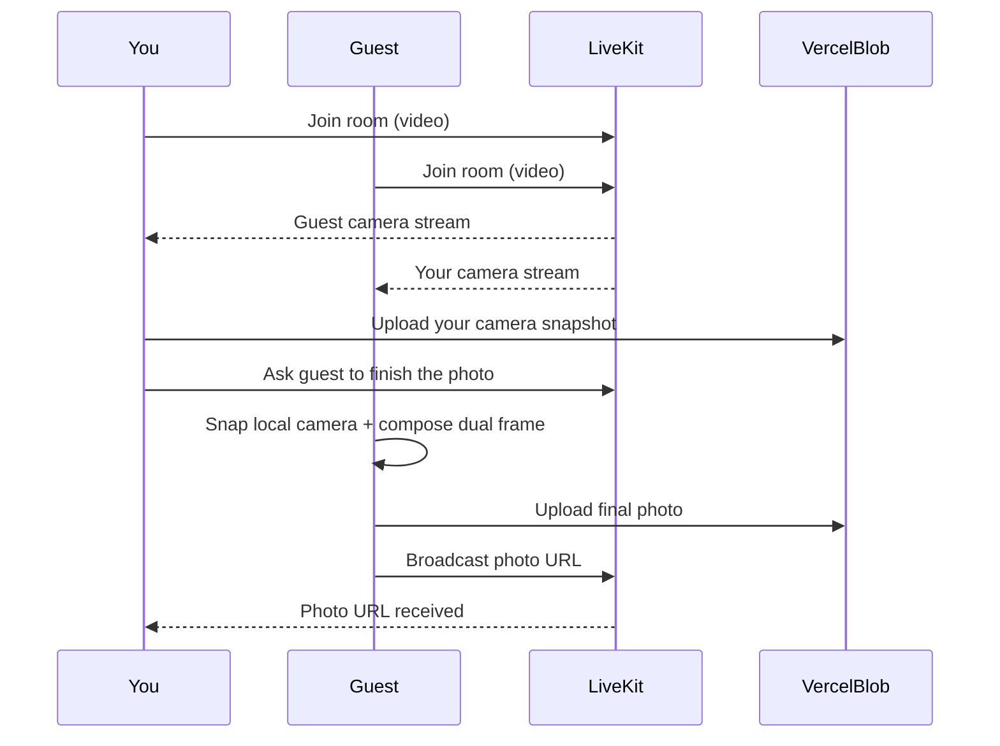

# Photobooth

A shared in-browser photobooth. Two people join the same room, see each other’s live camera feed, apply filters, take photos together, and download from a gallery that syncs on both devices.

## Features

- Shared live video via [LiveKit](https://livekit.io)
- Synced CSS filter presets
- Frame overlay baked into captures
- 3-second countdown before each photo
- One person captures → both see the same photo (LiveKit + Vercel Blob)
- Per-photo PNG download
- Optional passphrase gate (Edge Middleware)

## Tech stack

- Next.js 14 (App Router) + TypeScript + Tailwind CSS
- [LiveKit Cloud](https://cloud.livekit.io) — real-time video
- [Vercel Blob](https://vercel.com/docs/storage/vercel-blob) — photo storage

---

## Local setup

### Prerequisites

- [Node.js](https://nodejs.org/) 18+
- A free [LiveKit Cloud](https://cloud.livekit.io) project
- A GitHub account (for deploying to Vercel)

### 1. Clone and install

```bash
git clone <your-fork-or-repo-url>
cd Photo-booth
npm install
```

### 2. Create LiveKit credentials

1. Sign up at [cloud.livekit.io](https://cloud.livekit.io)
2. Create a project
3. Copy **API Key**, **API Secret**, and the WebSocket URL (`wss://…livekit.cloud`)

### 3. Configure environment variables

```bash
cp .env.local.example .env.local
```

Fill in `.env.local`:

| Variable | Required | Notes |
|----------|----------|--------|
| `LIVEKIT_API_KEY` | Yes | LiveKit Cloud → Settings → API Keys |
| `LIVEKIT_API_SECRET` | Yes | Same as above |
| `NEXT_PUBLIC_LIVEKIT_URL` | Yes | e.g. `wss://your-project.livekit.cloud` |
| `BLOB_READ_WRITE_TOKEN` | For photos | Easiest after linking Blob on Vercel (see deploy). For local-only testing you can skip until you deploy, or create a Blob store and paste the token. |
| `SITE_PASSPHRASE` | Optional | Enables the unlock gate |
| `SITE_COOKIE_SECRET` | Optional* | Required if passphrase is set — use a long random string |

\*Generate a secret with: `openssl rand -hex 32`

### 4. Run locally

```bash
npm run dev
```

Open [http://localhost:3000](http://localhost:3000).

**Phone cameras need HTTPS.** `localhost` works on the same machine; testing two real devices on LAN usually needs a tunnel (e.g. Cloudflare Tunnel) or a deployed Vercel URL.

### 5. Try the booth

1. Unlock with the passphrase (if configured), then open the photobooth
2. Enter a display name and room name (e.g. `demo-room`)
3. Copy the share link and open it on a second device
4. Join from both sides → take a photo → check the shared gallery

---

## Deploy and host on Vercel

Anyone can host their own copy with a free Vercel Hobby account.

### 1. Put the code on GitHub

Push this project to a GitHub repository you own.

### 2. Import the project in Vercel

1. Go to [vercel.com/new](https://vercel.com/new)
2. Import the GitHub repo
3. Framework preset should be **Next.js**; root directory `./`
4. Do **not** deploy yet until env vars and Blob are ready (or deploy once, then add vars and redeploy)

### 3. Install the Vercel GitHub app (if prompted)

Choose **Only select repositories** and pick this repo, then install.

### 4. Create a Blob store (required for photos)

1. Open the Vercel project → **Storage** → create a **Blob** store
2. Use a **Public** Blob store (this app uploads with public access)
3. Connect it to the project so `BLOB_READ_WRITE_TOKEN` is available, or copy the token into Environment Variables manually

### 5. Add environment variables

In the project → **Settings** → **Environment Variables**, add (for Production and Preview):

- `LIVEKIT_API_KEY`
- `LIVEKIT_API_SECRET`
- `NEXT_PUBLIC_LIVEKIT_URL`
- `BLOB_READ_WRITE_TOKEN`
- `SITE_PASSPHRASE` (optional)
- `SITE_COOKIE_SECRET` (optional, but required if you set a passphrase)

### 6. Deploy

Click **Deploy** (or push to `main` to trigger a redeploy).

### 7. Turn off Vercel login walls (important for sharing)

If visitors are asked to log into **Vercel** (not your passphrase gate):

1. Project → **Settings** → **Deployment Protection**
2. Set **Production** protection to **None** (disable Vercel Authentication)

Share the **production** URL (e.g. `https://your-app.vercel.app`), not a Preview deployment link.

### 8. Smoke test

1. Open the production URL on two devices (HTTPS)
2. Unlock with your passphrase if enabled
3. Join the same room via the share link
4. Capture a photo from each device and confirm the gallery syncs
5. In Vercel → **Storage** → Blob → browse `sessions/…` if you want to inspect uploads

---

## How shared photos work



Photos are stored under `sessions/{sessionId}/` in Vercel Blob and are deleted when the last person leaves the session.

---

## Make it generic (remove personal touches)

This repo is meant as a reusable photobooth. Before sharing publicly, check:

| Area | Where to edit | Suggestion |
|------|----------------|------------|
| Site title / meta description | `src/app/layout.tsx` | Keep product name generic (e.g. “Photobooth”) |
| Gate headline | `src/app/page.tsx` | Avoid couple names, dates, “ours”, etc. |
| Landing brand + tagline | `src/components/LandingPage.tsx` | Swap brand, eyebrow, and supporting line |
| Session header | `src/components/SharedPhotobooth.tsx` | No event-specific titles |
| Lobby labels | `src/components/RoomLobby.tsx` | Neutral room placeholders (`demo-room`) |
| Frame artwork | `public/overlays/frame-ornate.svg` | Replace with your own SVG/PNG |
| Overlay registry | `src/lib/overlays.ts` | Point at your frame file |
| Colors / fonts | `src/app/globals.css`, `src/app/layout.tsx` | Retheme away from the antique palette if needed |
| Wallpaper pattern | `.antique-stage` in `globals.css` | Change or remove the camera motif background |
| Download filenames | `src/components/Gallery.tsx` | Use a neutral prefix like `photobooth-photo-…` |
| Default room name | lobby + LiveKit token routes | Use `photobooth` / `room`, not personal event names |
| Passphrase | Vercel env `SITE_PASSPHRASE` | Use a new secret; don’t reuse personal phrases |
| Package name | `package.json` | Keep `photobooth` (or your product name) |

Also remove any personal assets, screenshots, or docs that mention a private event before publishing the repo.

---

## Privacy notes

- Live video goes through LiveKit (encrypted WebRTC)
- Captured photos are public Blob URLs for that session — fine behind a passphrase for casual privacy, not for highly sensitive content
- The passphrase gate is a lightweight lock, not strong authentication

## Project structure

```
src/
├── app/
│   ├── page.tsx                  # Optional passphrase gate
│   ├── home/page.tsx             # Landing
│   ├── photobooth/page.tsx       # Lobby + shared session
│   ├── api/livekit/token/        # LiveKit access tokens
│   ├── api/photos/               # Blob upload + list + wipe
│   └── api/gate/                 # Passphrase cookie
├── components/
│   ├── SharedPhotobooth.tsx      # LiveKit room + capture flow
│   ├── DualCameraView.tsx        # Side-by-side feeds
│   ├── RoomLobby.tsx             # Join room + copy link
│   └── LandingPage.tsx           # Home landing
└── lib/
    ├── captureFrame.ts           # Canvas capture / compose
    ├── room.ts                   # Room helpers + sync messages
    └── overlays.ts               # Frame overlay registry
```
